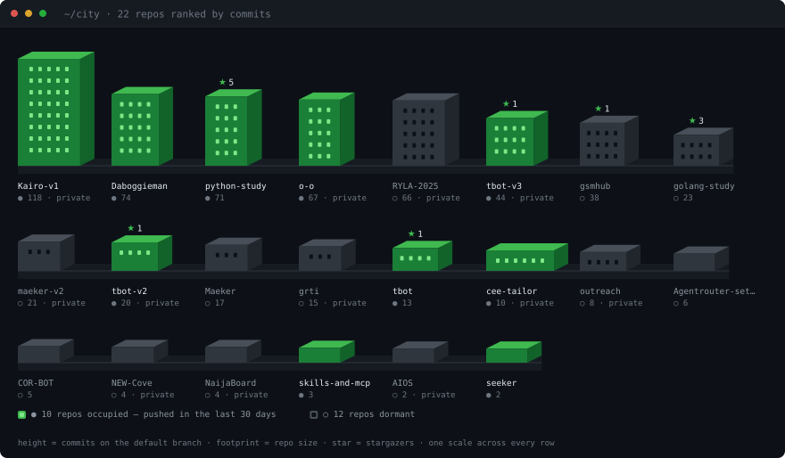
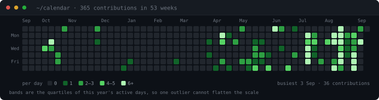
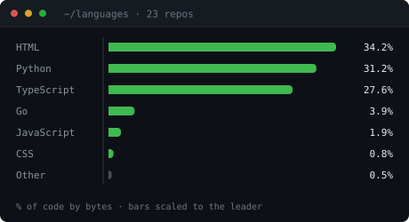
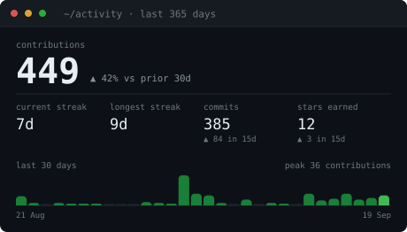
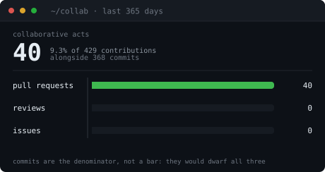
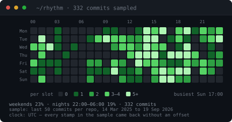
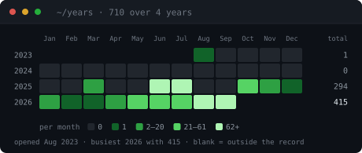
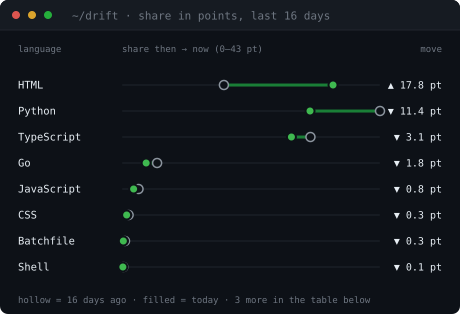

<div align="center">



</div>

## About me

- i think i know more than i did yesterday **(sacrificed some hours of sleep though)**
- Comfortable across the stack — from Go microservices to Python tooling to mobile apps
- Based in Nigeria
- Currently hunting bugs I probably wrote myself

<br/>

## Skyline

Every repository I own is a building: height is commits on the default branch,
footprint is size on disk, a lit facade means I pushed to it in the last 30 days.
Private repos are in here too — counted for their activity, never linked, because
the link would 404 for everyone but me.

<div align="center">



</div>

<br/>

## Calendar

A year of contributions, one cell per day. The four shades are the quartiles of my
own active days rather than fractions of the busiest one, so a single heavy day
cannot flatten the rest of the year into a single tone. Every band prints its
numeric range in the legend, so the chart still reads with no colour at all.

<div align="center">



</div>

<br/>

## Languages and activity

<div align="center">




</div>

<br/>

## Collaboration and rhythm

Left: the share of a year that involved somebody else. Commits are deliberately not
one of the bars — a few dozen pull requests beside twelve hundred commits is a
sliver on a shared axis, so commits are the denominator the headline is quoted
against instead. Right: when the commits actually land, hour of day against day of
week, drawn from the last fifty commits on each default branch and labelled with
which clock it read.

<div align="center">




</div>

<br/>

## Years and drift

Left: the whole record at once, one row per year and one cell per month, so a column
is a season — scan down March and you can see whether March is always busy or was
busy once. Right: the only derivative on this page. Every other card is a level; this
one is which way the language mix is moving, in percentage points, measured against a
reading the archive kept a month ago. It cannot be reconstructed after the fact, so
it starts the day the archive does.

<div align="center">




</div>

<br/>

## Featured projects

<div align="center">

| Project | What it is |
|---|---|
| 🏋️ **Kairo** | Personal all-in-one fitness app — workouts, progress, GPS tracking, offline-first *(in development, private)* |
| 🐍 **[python-study](https://github.com/Daboggieman/python-study)** | Python experiments and learning projects |
| 📡 **[gsmhub](https://github.com/Daboggieman/gsmhub)** | check it out yourself, its kinda cringe tho |
| 🐹 **[golang-study](https://github.com/Daboggieman/golang-study)** | Go experiments and learning projects |
| 🛠️ **[Maeker](https://github.com/Daboggieman/Maeker)** | Python project |
| 🤖 **[tbot](https://github.com/Daboggieman/tbot)** | Python-based trading algorithm project *(in development)* |
| 🔌 **[Agentrouter-setup](https://github.com/Daboggieman/Agentrouter-setup)** | Shell scripts for setting up an agent router |
| 🐍 **[COR-BOT](https://github.com/Daboggieman/COR-BOT)** | Baby Tbot *tbot-v0* |

</div>

<br/>

## Stack

```console
$ cat stack.txt
languages   Go · Python · TypeScript · JavaScript · Shell
mobile      Expo · React Native · expo-router · expo-sqlite · MapLibre · Zustand
data        PostgreSQL · MongoDB · Redis · SQLite
ops         Docker · Git · GitHub Actions · Vercel · Render · Heroku
testing     Jest · go test
```

<br/>

## Contribution snake

<div align="center">


</div>

<br/>

<details>
<summary>Open the table view</summary>

<!-- cards:table:start -->

| Right now | Reading |
|---|---|
| Focus | o-o · Python · pushed 1 hour ago · 51 contributions this week |
| Last 7 days | 51 contributions |

| Language | Share | Tracked size |
|---|---:|---:|
| Python | 42.2% | 2.6 MB |
| TypeScript | 30.8% | 1.9 MB |
| HTML | 16.7% | 1.0 MB |
| Go | 5.7% | 358.7 kB |
| JavaScript | 2.7% | 170.3 kB |
| CSS | 1.1% | 67.8 kB |
| Other | 0.8% | 52.3 kB |

| Metric | Last 365 days | Change |
|---|---:|---:|
| Contributions | 345 | — |
| Commits | 297 | — |
| Pull requests | 30 | — |
| Issues | 0 | — |
| Reviews | 0 | — |
| Current streak | 5 days | — |
| Longest streak | 9 days | — |
| Repositories | 19 | — |
| Stars earned | 9 | — |
| Followers | 10 | — |
| Collaborative acts | 30 (8.7% of all) | — |

| Calendar | Value |
|---|---:|
| Busiest day | 3 Sep 2026 (36 contributions) |
| Days with nothing | 299 of 370 days |
| Days with something | 71 |

| Commit rhythm | Value |
|---|---:|
| Busiest slot | Thu 18:00–18:59 (15 commits) |
| Sample | 296 commits, 14 Mar 2025 to 4 Sep 2026 |
| Weekend work | 17% of the sample |
| Nights, 22:00–06:00 | 15% of the sample |
| Clock | UTC — every stamp in the sample came back without an offset |

| Year | Contributions | Active days | Busiest month |
|---|---:|---:|---|
| 2023 | 1 | 1 | Aug (1) |
| 2024 | 0 | 0 | Jan (0) |
| 2025 | 294 | 41 | Jun (147) |
| **2026** | 319 | 63 | Aug (142) |

<sub>The account opened 12 August 2023, so anything before that is absent rather than quiet.</sub>

| Building | Commits | Size | Stars | Last push | State | Access |
|---|---:|---:|---:|---|---|---|
| Kairo-v1 | 95 | 8.0 MB | 0 | 4 Sep 2026 | occupied | private |
| [python-study](https://github.com/Daboggieman/python-study) | 70 | 341.0 kB | 2 | 24 Aug 2026 | occupied | public |
| RYLA-2025 | 66 | 23.2 MB | 0 | 12 Jul 2025 | dormant | private |
| [Daboggieman](https://github.com/Daboggieman/Daboggieman) | 48 | 6.9 MB | 0 | 4 Sep 2026 | occupied | public |
| [gsmhub](https://github.com/Daboggieman/gsmhub) | 38 | 2.4 MB | 1 | 18 Aug 2026 | occupied | public |
| tbot-v3 | 36 | 7.4 MB | 1 | 11 Aug 2026 | occupied | private |
| [golang-study](https://github.com/Daboggieman/golang-study) | 23 | 3.8 MB | 3 | 2 Jul 2026 | dormant | public |
| maeker-v2 | 21 | 375.0 kB | 0 | 18 Aug 2026 | occupied | private |
| tbot-v2 | 18 | 5.3 MB | 1 | 2 Jul 2026 | dormant | private |
| [Maeker](https://github.com/Daboggieman/Maeker) | 17 | 415.0 kB | 0 | 27 Jun 2026 | dormant | public |
| grti | 15 | 418.0 kB | 0 | 5 Apr 2026 | dormant | private |
| [tbot](https://github.com/Daboggieman/tbot) | 10 | 3.7 MB | 1 | 11 Jan 2026 | dormant | public |
| [o-o](https://github.com/Daboggieman/o-o) | 8 | 11.0 kB | 0 | 4 Sep 2026 | occupied | public |
| outreach | 8 | 5.1 MB | 0 | 4 Aug 2026 | dormant | private |
| [Agentrouter-setup](https://github.com/Daboggieman/Agentrouter-setup) | 6 | 11.0 kB | 0 | 18 Aug 2026 | occupied | public |
| [COR-BOT](https://github.com/Daboggieman/COR-BOT) | 5 | 107.0 kB | 0 | 14 Jul 2025 | dormant | public |
| NEW-Cove | 4 | 295.0 kB | 0 | 2 Dec 2025 | dormant | private |
| NaijaBoard | 4 | 89.0 kB | 0 | 11 Aug 2026 | occupied | private |
| AIOS | 2 | 42.0 kB | 0 | 9 Jan 2026 | dormant | private |

<sub>Building height is commits on the default branch, footprint is repo size, and a lit facade means pushed within 30 days. Private repositories are listed for their activity only — they are not linked, because the link would 404 for everyone but me.</sub>

<sub>Generated by <code>./cmd/cards</code> on 4 September 2026. Includes 10 private repositories, counted for activity but not linked.</sub>

<!-- cards:table:end -->

</details>

<br/>

```console
$ go run ./cmd/cards -login Daboggieman     # live data
$ go run ./cmd/cards -fixture testdata/profile.json   # offline, deterministic
$ go test ./...
```

<br/>

## Connect

<div align="center">

[](https://github.com/Daboggieman)

</div>
